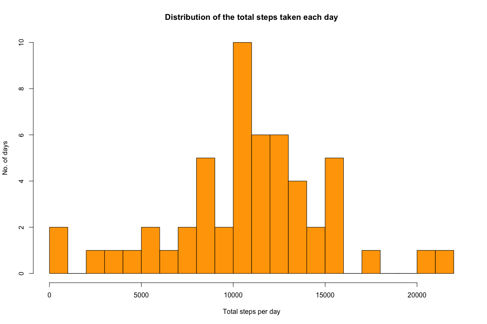
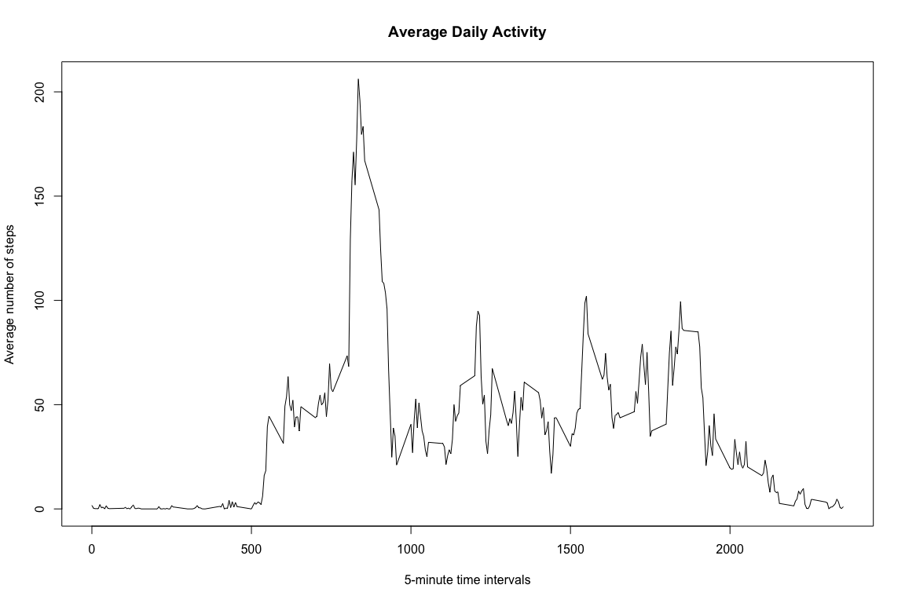
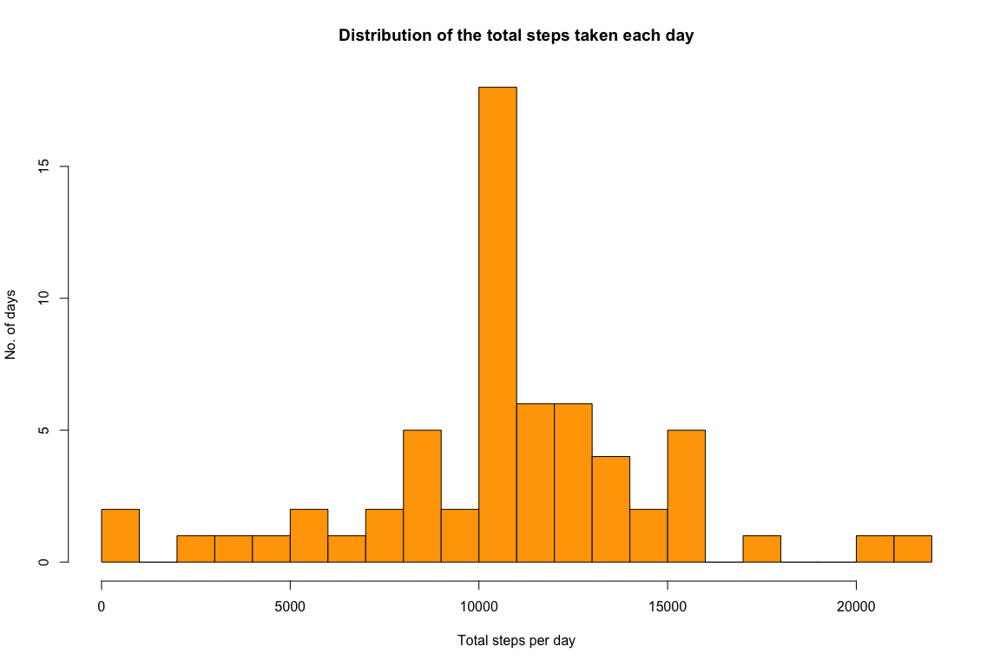
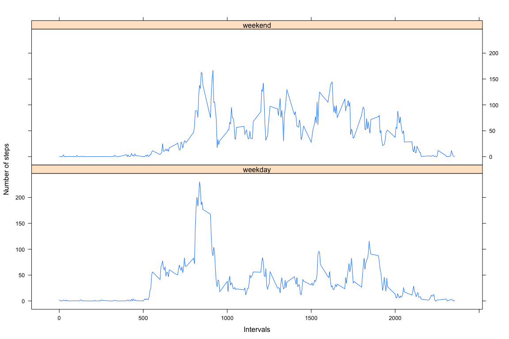

## Loading and preprocessing the data
#### Set Global settings:

```r
knitr::opts_chunk$set(fig.width=12, fig.height=8,
                      echo = TRUE, warning = FALSE, message = FALSE)
```

#### Load and read the data (i.e. activity.csv) and change date variable from factor to Date class:

```r
if(!file.exists('activity.csv')){
    unzip('activity.zip')
}
activity <- read.csv("activity.csv", colClasses = c(date = "Date"))
options(scipen = 1)  # Turn off scientific notations for numbers
```

## What is mean total number of steps taken per day?

#### Calculate the total number of steps taken per day using the dplyr library:

```r
library(dplyr)
totalstepsperday <- activity %>% 
                    group_by(date) %>%
                    summarise(totalsteps = sum(steps, na.rm = FALSE))
```

#### Then, plot a histogram of the total number of steps taken each day:

```r
hist(totalstepsperday$totalsteps, 
     main = "Distribution of the total steps taken each day", 
     xlab = "Total steps per day", 
     ylab = "No. of days", 
     breaks = 20, 
     col = "orange")
```

<!-- -->

#### Calculate the mean and median number of steps taken each day:

```r
meansteps <- mean(totalstepsperday$totalsteps, na.rm = TRUE)
mediansteps <- median(totalstepsperday$totalsteps, na.rm = TRUE)
```

#### The mean number of steps taken each day is 10766.1886792 and the median is 10765.

## What is the average daily activity pattern?

#### Calculate average number of steps per 5 minute interval:

```r
avgstepsint <- activity %>% 
               group_by(interval) %>%
               summarise(avgsteps = mean(steps, na.rm = TRUE))
```

#### Then, plot time series plot of the average number of steps taken:

```r
plot(avgstepsint$interval, avgstepsint$avgsteps, type = "l", 
     main = "Average Daily Activity", 
     xlab = "5-minute time intervals", 
     ylab = "Average number of steps")
```

<!-- -->

#### Calculate the 5-minute interval that, on average, contains the maximum number of steps:

```r
maxint <- avgstepsint[avgstepsint$avgsteps == max(avgstepsint$avgsteps), ]
```

#### The 835 minute interval contains the maximum number of steps on average.

## Imputing missing values

#### Calculate and report the total number of missing values in the dataset (i.e. the total number of rows with 𝙽𝙰s):

```r
NArows <- sum(is.na(activity))
```
#### There are 2304 missing values in the dataset.

#### One strategy we can use to tackle this problem of missing values is to use the mean of the 5-minute interval as a substitute for NAs.

#### Create new dataset with missing values imputed:

```r
newactivity <- activity
for(i in 1:nrow(newactivity)){
  if(is.na(newactivity$steps[i])){
    newactivity$steps[i] <- avgstepsint[which(newactivity$interval[i] == avgstepsint$interval), ]$avgsteps
  }
}
```

#### Calculate the total number of steps taken each day after missing values are imputed:

```r
newtotalstepsperday <- newactivity %>% 
                    group_by(date) %>%
                    summarise(totalsteps = sum(steps, na.rm = TRUE))
```

#### Plot histogram of the total number of steps taken each day after missing values are imputed:

```r
hist(newtotalstepsperday$totalsteps, 
     main = "Distribution of the total steps taken each day", 
     xlab = "Total steps per day", 
     ylab = "No. of days", 
     breaks = 20, 
     col = "orange")
```

<!-- -->

#### Calculate and report the new mean and median total number of steps taken per day:

```r
newmeansteps <- mean(newtotalstepsperday$totalsteps)
newmediansteps <- median(newtotalstepsperday$totalsteps)
```

#### The new mean number of steps taken each day is 10766.1886792 and the median is 10766.1886792.

#### The mean values are similar from the estimates from the first part of the assignment but the median values are higher when missing values are imputed.

## Are there differences in activity patterns between weekdays and weekends?

#### Create a new factor variable in the dataset with two levels – “weekday” and “weekend” indicating whether a given date is a weekday or weekend day:

```r
newactivity <- newactivity %>%
                    mutate(weekend.indicator =
                    as.factor(ifelse(weekdays(date) %in% 
                    c("Saturday","Sunday"), "weekend","weekday")))
```

#### Calculate average number of steps per 5 minute interval, averaged across all weekday days or weekend days:

```r
newavgstepsint <- newactivity %>%
  group_by(weekend.indicator,interval) %>%
  summarise(avgsteps = mean(steps))
```

#### Then, plot time series plot of the average number of steps taken, averaged across all weekday days or weekend days:

```r
library(lattice)
xyplot(newavgstepsint$avgsteps ~ newavgstepsint$interval | newavgstepsint$weekend.indicator, layout = c(1, 2), type = "l", xlab = "Intervals", ylab = "Number of steps")
```

<!-- -->
